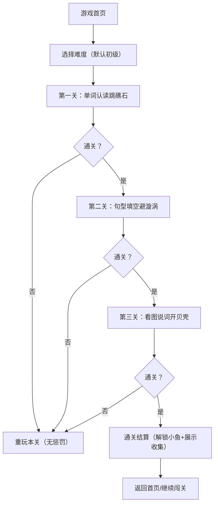

# 小鱼冲关大冒险 - Web小游戏开发需求文档
## 一、项目核心信息
| 项目名称 | 小鱼冲关大冒险（三年级英语课后练习小游戏） |
|----------|----------------------------------------------|
| 目标用户 | 小学三年级小女孩（英语基础：认识26字母、基础单词/简单句型） |
| 核心目标 | 以小鱼闯关为载体，融入英语单词认读、句型匹配、单词拼写练习，交互有趣、无挫败感 |
| 适配终端 | 电脑端（鼠标点击/拖拽 + 简易键盘输入）|
| 视觉风格 | 马卡龙色系（粉/浅蓝/嫩黄/浅绿），圆润卡通风格，无尖锐图案，符合小女孩审美 |

## 二、核心玩法与流程
### 2.1 整体流程

### 2.2 核心规则
1. 每关无失败惩罚，仅“暂停/轻微提示”，闯关失败可一键重玩；
2. 每关通关解锁1条专属卡通小鱼，收集到“我的小鱼缸”；
3. 全程搭配**儿童版温柔英文发音+中文提示音**，无嘈杂音效；
4. 单局游戏时长控制在5-8分钟，每关操作步数≤15步。

## 三、功能模块详细设计
### 3.1 游戏首页
| 元素 | 设计要求 | 交互逻辑 |
|------|----------|----------|
| 游戏标题 | “小鱼冲关大冒险”卡通艺术字，搭配游动的小鱼动效 | 无交互，仅视觉吸引 |
| 开始游戏按钮 | 圆润按钮（粉色+小鱼图案），尺寸≥80×40px（方便孩子点击） | 点击进入难度选择界面 |
| 我的小鱼缸按钮 | 小鱼缸图标+“已收集X/3条小鱼”提示 | 点击查看已解锁的小鱼，可拖拽摆放/改名 |
| 音量控制 | 喇叭图标（静音/音量调节），位置在右上角 | 点击切换静音/非静音，无复杂调节 |
| 难度选择 | 初级（默认）/进阶/综合，对应不同英语考点难度 | 首次进入默认初级，通关后解锁进阶 |

### 3.2 第一关：单词认读跳礁石
#### 3.2.1 界面布局
| 区域 | 元素 | 设计要求 |
|------|------|----------|
| 背景区 | 海底珊瑚礁场景，浅蓝底色，飘动的水草/气泡动效 | 动效缓慢柔和，不分散注意力 |
| 主角区 | 卡通小鱼（初始为粉色圆尾鱼），尺寸≥60×40px | 小鱼初始在屏幕左侧起点位置 |
| 障碍区 | 10-12块珊瑚礁石（圆润造型），横向排列成“路径” | 每块礁石标有**中文词汇**（如红色/铅笔/猫/5） |
| 提示区 | 屏幕下方固定区域，显示**英文单词**（如red/pencil/cat/five） | 单词字体≥20px，加粗，搭配语音朗读 |
| 操作区 | 无额外按钮，直接点击礁石即可 | 礁石点击区域≥50×50px，方便孩子操作 |

#### 3.2.2 交互逻辑
1. 进入关卡后，自动朗读提示区的英文单词（如“red，红色”）；
2. 孩子点击标有对应中文的礁石，小鱼会“摆尾跳跃”到该礁石上，播放轻柔跳跃音效；
3. 点错礁石：出现卡通小水怪（无恐怖感），小鱼暂停1秒，播放“唔”的轻柔提示音，不退回起点；
4. 小鱼跳完所有正确礁石，抵达终点→通关，播放“耶”的欢呼音，解锁第一条小鱼（蓝色长条鱼）；
5. 通关后显示“太棒啦！解锁新小鱼～”，提供“下一关”/“重玩”/“返回首页”按钮。

#### 3.2.3 英语考点适配（三年级）
| 难度 | 单词类型 | 示例 |
|------|----------|------|
| 初级 | 颜色/数字（1-10） | red, blue, five, eight |
| 进阶 | 文具/动物 | pencil, book, cat, bird |
| 综合 | 日常用品 | bag, cup, desk, chair |

### 3.3 第二关：句型填空避漩涡
#### 3.3.1 界面布局
| 区域 | 元素 | 设计要求 |
|------|------|----------|
| 背景区 | 海底漩涡场景，浅蓝渐变底色，缓慢旋转的小漩涡动效 | 漩涡动效柔和，不刺眼 |
| 主角区 | 第一关解锁的小鱼（蓝色长条鱼） | 小鱼初始在左侧起点，可轻微游动 |
| 障碍区 | 5-6个漩涡，每个漩涡上方显示**不完整句型** | 句型字体≥18px，漩涡点击/拖拽区域≥60×60px |
| 选项区 | 屏幕下方，3个漂浮的单词卡片（圆润造型） | 卡片尺寸≥70×40px，标有英文单词 |
| 提示区 | 句型朗读按钮（喇叭图标） | 点击重复朗读当前不完整句型 |

#### 3.3.2 交互逻辑
1. 进入关卡后，小鱼前方出现第一个漩涡，漩涡上显示不完整句型（如“I have a ______”），自动朗读句型；
2. 孩子拖拽下方正确的单词卡片（如pen）填入句型空格，空格处有“磁吸效果”（拖拽到附近自动吸附）；
3. 填对后：漩涡消失，小鱼加速绕开，播放“哗啦啦”的水流音效，同时朗读完整句型（如“I have a pen”）；
4. 填错后：单词卡片弹回原位，漩涡轻微震动，播放“唔”的提示音，不扣除次数，可重新选择；
5. 完成所有漩涡的句型填空，小鱼抵达彩虹贝壳岛→通关，解锁第二条小鱼（黄色斑点鱼）。

#### 3.3.3 英语考点适配（三年级）
| 难度 | 句型类型 | 示例 |
|------|----------|------|
| 初级 | 基础名词句型 | I have a ______ (pen/book/cat) This is a ______ (desk/bag/bird) |
| 进阶 | 颜色+名词句型 | It's ______ (red/blue/yellow) The ______ is red (pen/book/bag) |
| 综合 | 数字+名词句型 | I see ______ (five/eight) ______ (cats/books) |

### 3.4 第三关：看图说词开贝壳
#### 3.4.1 界面布局
| 区域 | 元素 | 设计要求 |
|------|------|----------|
| 背景区 | 彩虹贝壳岛场景，多彩珊瑚+闪光贝壳，柔和闪光动效 | 闪光频率≤1次/2秒，不刺眼 |
| 操作区 | 10个闭合的卡通贝壳（圆润造型），3×4网格排列 | 贝壳尺寸≥60×60px，点击区域大 |
| 输入区 | 贝壳下方，简易字母键盘（26字母+删除/确认） | 字母按键尺寸≥40×40px，字体≥20px |
| 提示区 | 点击贝壳后显示图片，下方有“提示”按钮 | 提示按钮仅高亮第一个正确字母，不直接给答案 |

#### 3.4.2 交互逻辑
1. 进入关卡后，显示10个闭合贝壳，提示“点击贝壳，拼出对应的英语单词吧～”；
2. 孩子点击贝壳，贝壳张开一半，显示图片（如一只猫、一支铅笔、蓝色的球）；
3. 孩子通过字母键盘输入对应单词，输入过程中实时显示已输入字母；
4. 拼写正确：贝壳完全打开，露出小鱼饲料/装饰，播放“叮”的音效，自动朗读单词；
5. 拼写错误：输入框轻微震动，播放“唔”的提示音，可点击删除键重新输入；
6. 打开所有贝壳→通关，解锁第三条小鱼（稀有款：粉色带蝴蝶结小鱼），进入结算界面。

#### 3.4.3 英语考点适配（三年级）
| 难度 | 单词长度 | 示例 |
|------|----------|------|
| 初级 | 3-4个字母 | cat, pen, red, hat, fish |
| 进阶 | 5-6个字母 | book, bird, desk, apple, color |
| 综合 | 简单词组（拆分输入） | red pen（先输red，再输pen） blue bird（先输blue，再输bird） |

### 3.5 我的小鱼缸模块
| 功能 | 设计要求 | 交互逻辑 |
|------|----------|----------|
| 小鱼展示 | 背景为透明鱼缸，已解锁的小鱼在缸内自由游动 | 小鱼动效缓慢，可随鼠标轻微互动（靠近时摆尾） |
| 小鱼操作 | 支持拖拽小鱼调整位置，点击小鱼可改名 | 改名框支持中英文输入，输入后自动保存 |
| 收集进度 | 右上角显示“已收集X/3”，未解锁的小鱼显示“锁定”图标 | 解锁后自动替换为小鱼动效 |

## 四、技术要求
### 4.1 开发技术栈（推荐）
- 前端框架：HTML5 + CSS3 + JavaScript（或Vue.js/React，简易版优先原生JS）；
- 动效实现：CSS3动画/Canvas（小鱼游动、气泡飘动等）；
- 音效播放：HTML5 Audio（预加载音效，避免卡顿）；
- 数据存储：LocalStorage（保存已解锁小鱼、闯关进度，无需后端）。

### 4.2 核心技术要求
1. 兼容性：适配主流浏览器（Chrome/Firefox/Edge），无需兼容移动端；
2. 性能：加载速度≤3秒，动效流畅无卡顿，无冗余资源；
3. 交互反馈：所有操作（点击/拖拽/输入）均有**视觉+音效**双重反馈；
4. 容错性：字母输入/拖拽操作允许轻微偏差，磁吸效果降低操作难度；
5. 无障碍：字体清晰、按钮尺寸大，音效可关闭，无闪烁/频闪元素。

### 4.3 资源要求
#### 4.3.1 视觉资源
| 类型 | 要求 |
|------|------|
| 小鱼素材 | 3款专属小鱼（粉色圆尾/蓝色长条/黄色斑点/稀有款粉蝴蝶结），含游动/跳跃/欢呼动效 |
| 场景素材 | 珊瑚礁/漩涡/贝壳岛3个场景，气泡/水草等装饰素材（透明背景PNG） |
| UI素材 | 按钮/字母键盘/贝壳等UI元素（圆润卡通风格，马卡龙色） |

#### 4.3.2 音效资源
| 类型 | 要求 |
|------|------|
| 操作音效 | 跳跃音、欢呼音、提示音、解锁音（轻柔儿童版，音量≤60%） |
| 语音资源 | 儿童版英文发音（单词/句型）+ 中文提示音（如“太棒啦”“再试试吧”） |

## 五、验收标准
1. 核心流程：首页→闯关→通关→收集小鱼全流程可正常运行，无卡顿/报错；
2. 交互反馈：所有操作均有视觉+音效反馈，符合设计要求；
3. 英语适配：考点完全匹配三年级核心词汇/句型，发音清晰准确；
4. 体验要求：无挫败感，操作简单，单局时长≤8分钟，视觉风格符合小女孩审美；
5. 数据存储：闯关进度、已解锁小鱼可正常保存，刷新页面不丢失。

### 总结
1. 核心开发重点：以**小鱼闯关**为载体，将三年级英语（单词认读/句型匹配/拼写）融入每一关的核心操作，交互反馈要温柔、无惩罚，符合孩子的接受度；
2. 技术核心：优先保证**操作容错性**（磁吸、大按钮、提示功能）和**视觉/音效体验**（马卡龙色、轻柔音效），数据存储用LocalStorage简化开发；
3. 体验关键：单局时长控制在5-8分钟，每关解锁小鱼的收集机制能有效吸引孩子持续参与，同时避免过度游戏。

如果需要进一步细化某一模块（如UI标注、音效清单、英语单词库），或者提供简易的前端开发代码框架，都可以告诉我。